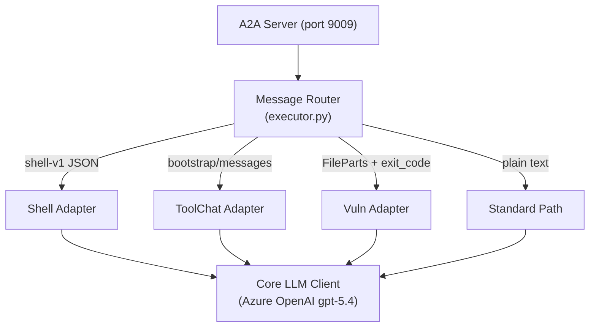

# AgentWhetters General Purple Agent

## Abstract

This agent demonstrates that a single reasoning architecture can achieve strong
cross-benchmark performance without benchmark-specific hardcoding. The core
design pairs a powerful LLM (Azure OpenAI gpt-5.4) with a thin layer of
protocol adapters that translate between the agent's unified reasoning loop and
the diverse interaction patterns presented by different green-agent evaluators.
Message routing is determined entirely by the structural format of incoming
messages, not by knowledge of which benchmark is running. The result is a
general-purpose agent that adapts to shell-command execution, tool-calling
compliance workflows, vulnerability analysis, and open-ended reasoning tasks
through the same codebase and model configuration.

## Overview

A general-purpose agent built on [Google ADK](https://adk.dev/) that handles
diverse task categories through a single unified architecture. Rather than
hardcoding benchmark-specific logic, the agent uses protocol adapters to
translate between the core reasoning engine and the various green-agent
interaction protocols it encounters.

## Architecture

## Design Principles

1. **No benchmark-specific hardcoding.** The agent never checks which benchmark
   is calling it. Routing decisions are based solely on the structure and
   protocol markers of the incoming message.

2. **Protocol adapters, not task handlers.** Each adapter translates a class of
   interaction pattern (shell commands, tool-calling chat, vulnerability
   analysis) into the format the core LLM expects. The same adapter serves any
   benchmark that uses the same protocol.

3. **Single reasoning core.** All adapters share the same underlying LLM client
   and model. Domain knowledge comes from the green agent's prompts and tool
   schemas, not from baked-in specialization.

4. **Stateful sessions where required.** Adapters maintain session state for
   multi-turn protocols (shell command execution, iterative code analysis) while
   keeping the routing layer stateless.

## Protocol Adapters

| Adapter | Protocol Pattern | Example Use Cases |
|---------|-----------------|-------------------|
| Shell | `terminal-bench-shell-v1` JSON envelope with command execution results | Terminal tasks, system administration |
| ToolChat | Bootstrap + turn messages with tool schemas and function calls | Compliance decisions, customer service, financial analysis |
| Vuln | Code snippets + execution feedback for vulnerability identification | Security analysis, exploit verification |
| Standard | Plain text or unstructured messages | General Q&A, open-ended reasoning |

## How It Works

1. An incoming A2A message arrives at the executor.
2. The router inspects the message content for protocol markers:
   - JSON with `protocol: "terminal-bench-shell-v1"` routes to Shell.
   - JSON with `messages` or `bootstrap` keys routes to ToolChat.
   - Messages matching vulnerability-analysis patterns route to Vuln.
   - Everything else takes the standard path.
3. The selected adapter formats the message for the LLM, manages any
   session state, and returns the response in the format the green agent
   expects.

## Adding New Protocols

To support a new interaction pattern:

1. Create a new adapter in `src/` (e.g., `newprotocol_adapter.py`).
2. Implement the detection function that identifies the protocol from message
   structure.
3. Implement the adapter class that manages session state and LLM interaction.
4. Register the detection and dispatch in `executor.py`.

No changes to the core agent, model configuration, or other adapters are
required.

## Competition Context

This architecture targets the [AgentBeats Sprint 4](https://rdi.berkeley.edu/agentx-agentbeats)
evaluation, which judges cross-benchmark performance, category diversity,
generality, cost efficiency, and technical quality. The protocol-adapter
approach demonstrates that a single agent architecture can adapt across
substantially different task types without benchmark-specific special-case
logic.
